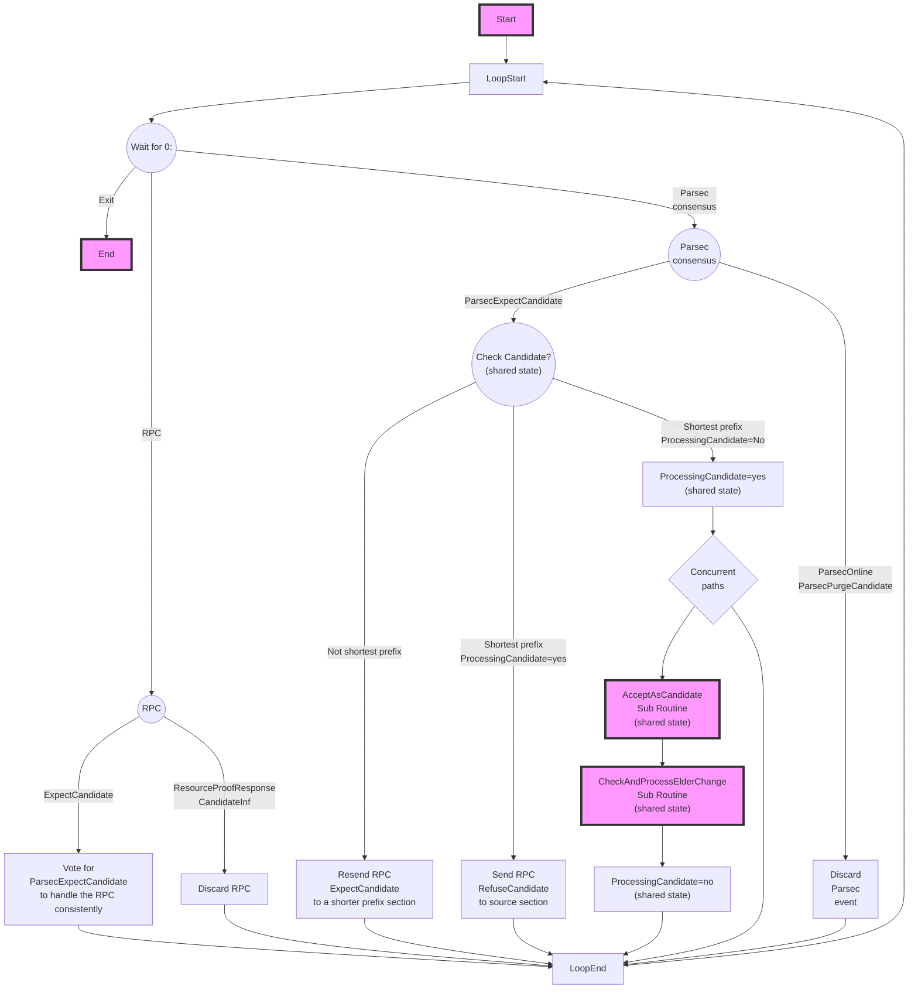
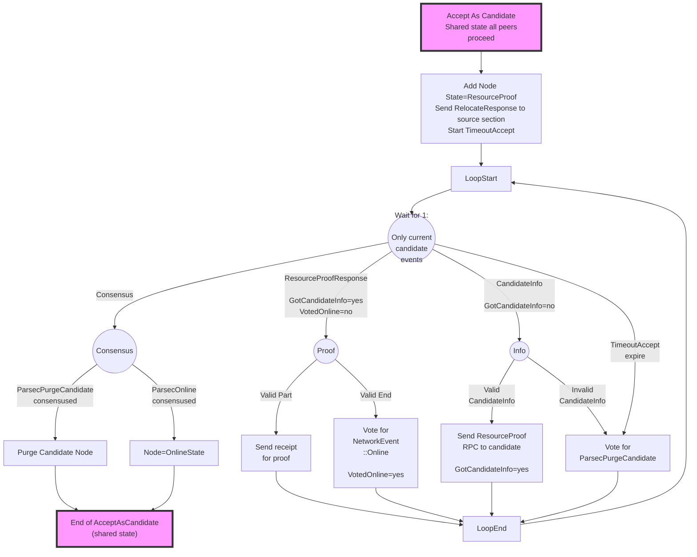
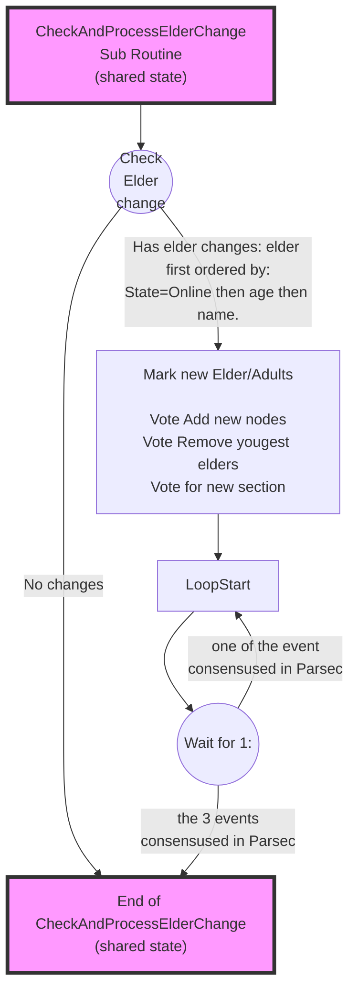
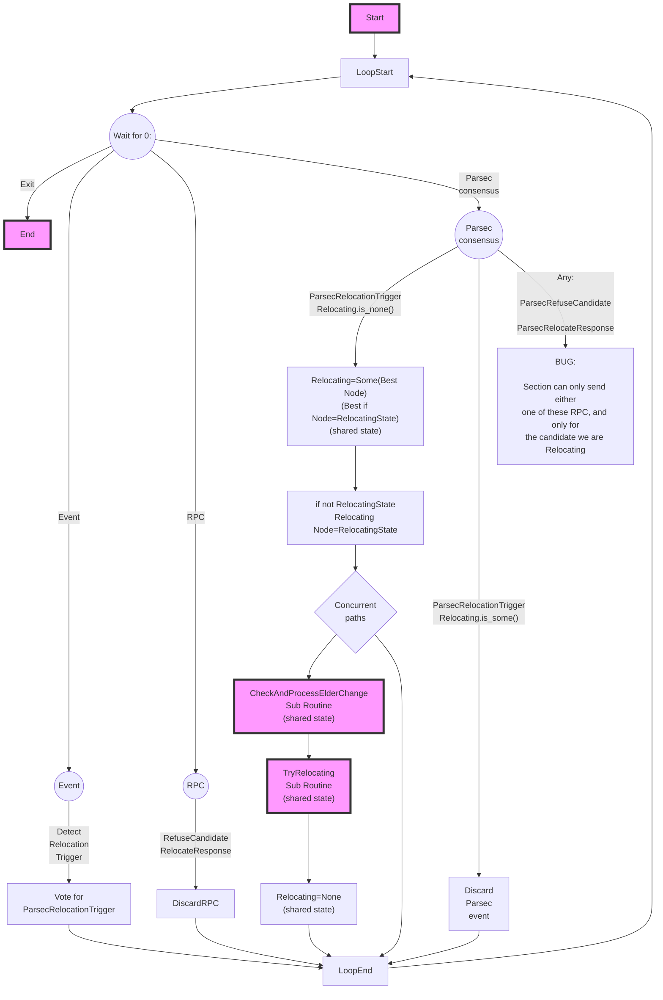
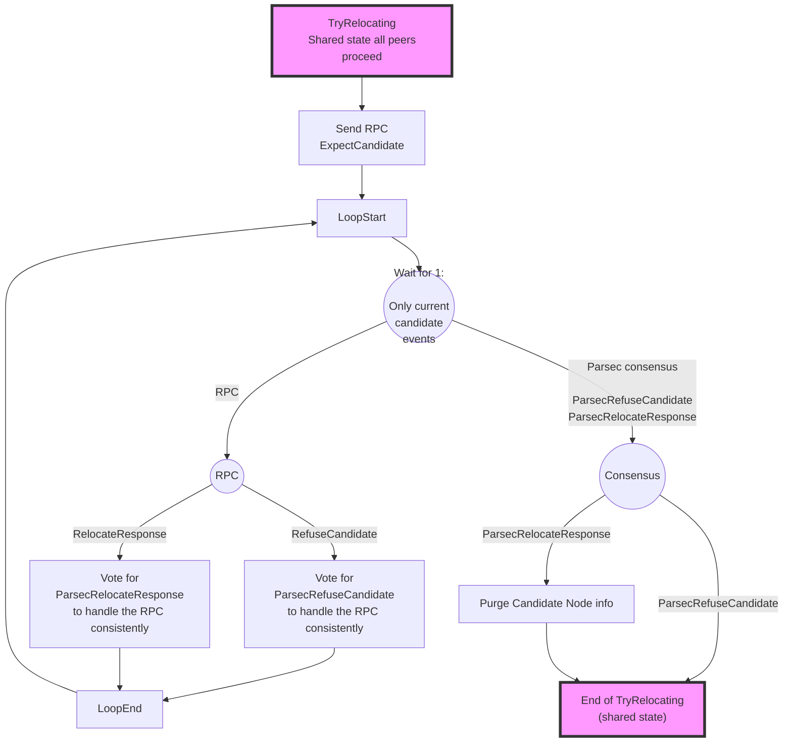

# Flow for routing add node(Draft)

This describe the flow for adding a Node to a section.

Notes:
- All event loops are common.
  So with `Wait For 0` and `Wait for 1`, first `1` will be processed, and if it did not process an event, `0` will attempt processing. The top most, `0`, will have to process remaining events (could discard them as needed).
- Condition can be split in multiple condition event:
  If a branch not provided, consider the condition never met.

Todo:
- WIP: Destination section flow
- WIP: Source section flow
- **Make Add/Remove Flow symetrical to avoid reaching a point where node is elder in 2 sections and other similar weirdness.**
- Run both source and destination event loops (Remove conflict between Add/Remove)
- Merge/Split

Unanswered Questions:
- Should ParsecExpectCandidate/ParsecRefuseCandidate/ParsecRelocateResponse be a quorum that we are looking for or a single observation?
- How do we ensure that we never forward a request twice? - Quorum?
- What do we do with ParsecExpectCandidate/ParsecRefuseCandidate/ParsecRelocateResponse that never reached quorum? (Is that a bug?)
- Many unknown unknown...

Note:
- ParsecPurgeCandidate/ParsecRefuseCandidate/ParsecRelocateResponse need payload (could be candidate+nonce) so previous candidate not affect current.

# Destination Section Flow
## Top Level Flow

## AcceptAsCandidate Sub-routine

## CheckAndProcessElderChange Sub-routine

# Source Section Flow
## Top Level Flow

## TryRelocating sub-routine

